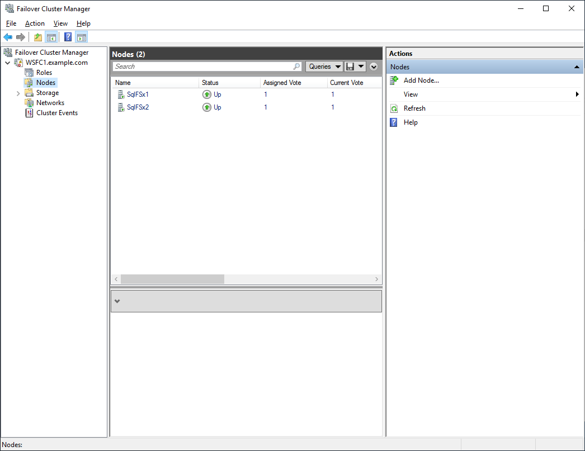

// Add steps as necessary for accessing the software, post-configuration, and testing. Don’t include full usage instructions for your software, but add links to your product documentation for that information.
//Should any sections not be applicable, remove them

== Post-deployment steps

=== Run Windows Updates

In order to ensure the deployed servers' operating systems and installed applications have the latest Microsoft updates, run Windows Update on each server.

1. Create an RDP session from the Remote Desktop Gateway server to each deployed server.
2. Open the *Settings* application.
3. Open *Update & Security*.
4. Click *Check for updates*.
5. Install any updates and reboot if necessary.

== Test the deployment
// If steps are required to test the deployment, add them here. If not, remove the heading

[start=1]
1. Open an RDP session to one of the two SQL servers.
2. Open Windows Administrative Tools and launch Failover Cluster Manager.

[#postdeploy1]
.Failover Cluster Manager
image::../images/image1.png[Architecture,width=100%,height=100%]

[start=3]
3. Select *nodes* and ensure both nodes are online.

[#postdeploy2]
.Both nodes showing online

[start=4]
4. Select the failover cluster and verify that both the cluster and the file share witness are online.

[#postdeploy3]
.Cluster overview showing cluster and file share witness are online
image::../images/image3.png[Architecture,width=100%,height=100%]

[start=5]
5. Download https://docs.microsoft.com/en-us/sql/ssms/download-sql-server-management-studio-ssms?view=sql-server-ver15[SQL Server Management Studio].
6. Install SQL Server Management Studio. Note that the installation will require a reboot.
7. After rebooting, log back into the SQL server.
8. Launch SQL Server Management Studio and connect to the FCI.

[#postdeploy4]
.Connecting to the cluster
image::../images/image4.png[Architecture,width=50%,height=50%]

[start=9]
9. If you are able to log in then the deployment was successful.

== Troubleshooting

If the deployment fails, open the https://console.aws.amazon.com/systems-manager/home?region=us-east-1[Systems Manager console] and select your deployment Region. Select *Automation* from the left-hand side and locate the failed automation document. Navigate to the failed step and expand *Output* to view the automation logs. Follow the link to CloudWatch Logs to view detailed automation logs.
