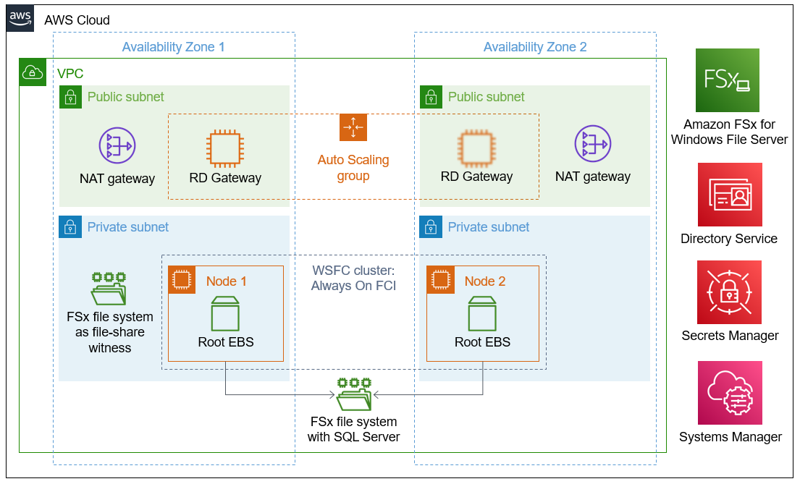
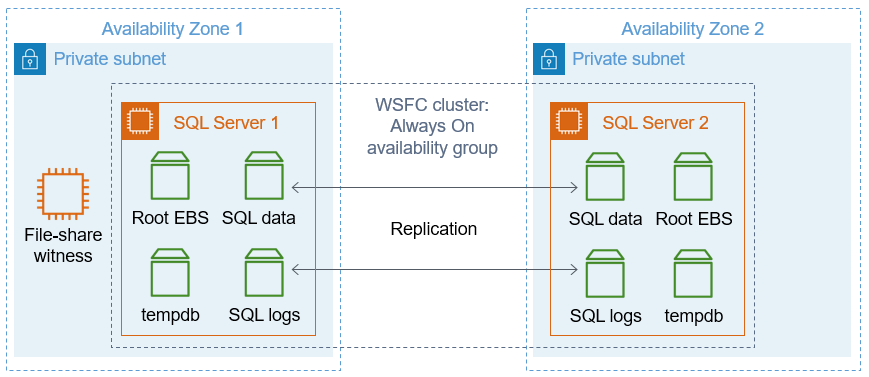

:xrefstyle: short

Deploying this Quick Start for a new VPC with default parameters builds the following environment in the AWS Cloud.

[#architecture1]
.Quick Start architecture for {partner-product-short-name} on AWS

As shown in <<architecture1>>, this Quick Start sets up the following:

* A highly available architecture that spans two Availability Zones.*
* A VPC configured with public and private subnets, according to AWS best practices, to provide you with your own virtual network on AWS.*
* In the public subnets:
** Managed network address translation (NAT) gateways to allow outbound internet access for resources in the private subnets.*
** A Remote Desktop Gateway (RD Gateway) host in an Auto Scaling group to allow inbound Remote Desktop Protocol (RDP) access to EC2 instances in public and private subnets.*
* In the private subnets:
** Two EC2 instances running Microsoft Windows with SQL Server. These instances are installed as nodes in a WSFC cluster in an Always On FCI configuration across the Availability Zones. Each node contains an Amazon Elastic Block Store (Amazon EBS) root volume.
* An Amazon FSx file system, which the FCI nodes share. SQL Server is installed in this file system. This file system also stores all SQL database and log files.*
* AWS Directory Service with a managed directory. The Amazon FSx file system and the EC2 Windows instances that host this architecture's nodes are joined to the same Active Directory domain.
* AWS Secrets Manager keys to store credentials.
* An AWS Systems Manager automation document to automate the deployment.

[.small]#*The template that deploys the Quick Start into an existing VPC skips the components marked by asterisks and prompts you for your existing VPC configuration.#

=== Always On replication: A comparison ===

To better understand the {partner-product-short-name} Quick Start, it's helpful to compare with the https://aws.amazon.com/quickstart/architecture/sql/[Quick Start for SQL Server with Always On Replication^]. Both Quick Starts are architected to ensure high availability. Both have EC2 instances clustered using WSFC. Both have database files stored in multiple Availability Zones. What's different is the way each Quick Start accomplishes database high availability.

[#architecture2]
.SQL Server with Always On Replication: A different approach to database high availability

With Always On replication, as shown in <<architecture2>>, two EC2 instances running Windows Server are deployed in separate Availability Zones. Each EC2 instance has a root EBS volume plus three other EBS volumes attached for storing SQL database-related files: the database files themselves, database log files, and `tempdb` files. 

*The Quick Start that uses Always On replication requires a full installation of SQL Server (Standard or Enterprise edition) on each EC2 instance.* Therefore, each server requires a SQL Server license.

Each EC2 instance is joined to a WSFC cluster. An https://docs.microsoft.com/en-us/sql/database-engine/availability-groups/windows/overview-of-always-on-availability-groups-sql-server[Always On availability group^] is configured across both servers. Databases installed in the availability group have their database and log files replicated across the cluster. If the primary server in the cluster becomes unavailable, the secondary server is promoted to become the primary, and traffic to the availability group is routed to it. 

The SQL Server with Always On Replication Quick Start, by default, does not use Amazon FSx. While it supports using an Amazon FSx file system as a file-share witness, by default it deploys an EC2 instance for this purpose.

=== What makes the {partner-product-short-name} Quick Start unique ===

Like the Always On replication architecture, the {partner-product-short-name} Quick Start, shown in <<architecture1>>, has two EC2 instances running Windows Server. And these EC2 instances are deployed across two Availability Zones and joined to a WSFC cluster. 

*What makes the FCI architecture unique is that it requires only one SQL Server license.* That's because it doesn't install SQL Server in the local file systems. Instead, it creates an Amazon FSx file system and installs SQL Server there. The FCI nodes share this file system.

That shared Amazon FSx file system also stores all the SQL database and log files. Unlike an availability group, an FCI does not replicate database-related files across the cluster. The FSx file system also acts as the file share witness for the WSFC cluster.

=== Advantages and disadvantages ===

*SQL Server with Always On Replication Quick Start:*

* Advantages: 
** The EBS volume type, capacity, and IOPS can be configured, allowing flexibility.
** It supports both AWS-provided licensing and Bring Your Own License models for Microsoft SQL.
* Disadvantage: 
** Each WSFC node with SQL Server installed requires a SQL Server license, increasing cost.

*{partner-product-short-name} Quick Start:*

* Advantage: It requires only one SQL Server license.
* Disadvantages:
** It relies on an Amazon FSx Multi-AZ file system, which is not supported in all AWS Regions.
** It requires the customer to provide a SQL Server .iso file and license since AWS-provided SQL licensing is not supported.